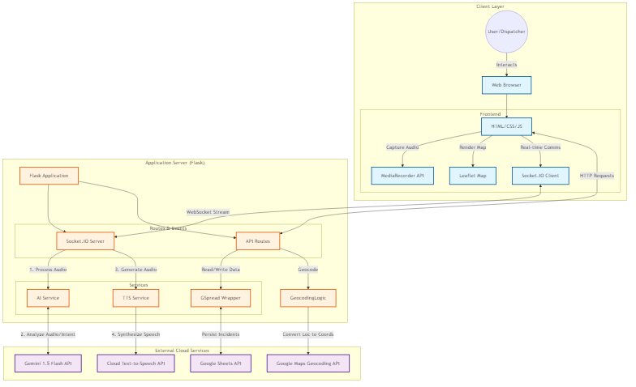

# RAPID-100 System Architecture

This document describes the high-level architecture of the RAPID-100 Emergency Response System.

## Architecture Diagram



Alternatively, view the Mermaid diagram source below:

```mermaid
graph TD
    subgraph "Client Layer"
        User((User/Dispatcher))
        Browser[Web Browser]
        
        User -->|Interacts| Browser
        
        subgraph "Frontend"
            UI[HTML/CSS/JS]
            SocketClient[Socket.IO Client]
            MediaRecorder[MediaRecorder API]
            Leaflet[Leaflet Map]
        end
        
        Browser --> UI
        UI -->|Capture Audio| MediaRecorder
        UI -->|Render Map| Leaflet
        UI -->|Real-time Comms| SocketClient
    end

    subgraph "Application Server (Flask)"
        Server[Flask Application (app.py)]
        
        subgraph "Routes & Events"
            SocketServer[Socket.IO Server]
            API_Routes[API Routes]
        end
        
        Server --> SocketServer
        Server --> API_Routes
        
        subgraph "Services"
            AIService[AI Service]
            TTSService[TTS Service]
            GSpreadWrapper[GSpread Wrapper]
        end
        
        SocketServer -->|1. Process Audio| AIService
        SocketServer -->|3. Generate Audio| TTSService
        API_Routes -->|Read/Write Data| GSpreadWrapper
        API_Routes -->|Geocode| GeocodingLogic
    end

    subgraph "External Cloud Services"
        Gemini[Gemini 1.5 Flash API]
        CloudTTS[Cloud Text-to-Speech API]
        MapsAPI[Google Maps Geocoding API]
        SheetsAPI[Google Sheets API]
    end

    SocketClient <-->|WebSocket Stream| SocketServer
    UI <-->|HTTP Requests| API_Routes
    
    AIService <-->|2. Analyze Audio/Intent| Gemini
    TTSService -->|4. Synthesize Speech| CloudTTS
    GeocodingLogic -->|Convert Loc to Coords| MapsAPI
    GSpreadWrapper <-->|Persist Incidents| SheetsAPI

    classDef client fill:#e1f5fe,stroke:#01579b,stroke-width:2px;
    classDef server fill:#fff3e0,stroke:#e65100,stroke-width:2px;
    classDef cloud fill:#f3e5f5,stroke:#4a148c,stroke-width:2px;

    class Browser,UI,SocketClient,MediaRecorder,Leaflet client;
    class Server,SocketServer,API_Routes,AIService,TTSService,GSpreadWrapper,GeocodingLogic server;
    class Gemini,CloudTTS,MapsAPI,SheetsAPI cloud;
```

## Component Overview

### 1. Client Layer
*   **Interface**: Web-based Dashboard & Dispatch Console.
*   **Tech Stack**: HTML5, CSS3, JavaScript (Vanilla).
*   **Key Libraries**:
    *   `socket.io-client`: Handles real-time bidirectional communication.
    *   `Leaflet.js`: Renders interactive maps for incident visualization.
    *   **MediaRecorder API**: Native browser API to capture microphone input as `audio/webm` chunks.

### 2. Application Server
*   **Core**: Python Flask Web Server.
*   **Networking**: `Flask-SocketIO` for WebSocket handling.
*   **Logic**:
    *   **Routes**: Handles page rendering (`/`, `/dispatch`) and API endpoints (`/submit_dispatch`).
    *   **Socket Events**: Listens for `audio_stream` events, processes them via AI Service, and emits `analysis_result` back to the client.

### 3. Internal Services
*   **AIService (`ai_service.py`)**:
    *   Manages interaction with **Google Gemini 1.5 Flash**.
    *   Features: Silence detection, Hallucination filtering, Context memory, and JSON response parsing.
    *   Task: Converts Audio Blob -> Transaction + Intent + Sentiment + Priority.
*   **TTSService (`tts_service.py`)**:
    *   Wraps **Google Cloud Text-to-Speech**.
    *   Converts AI-generated text responses into MP3 audio for playback on the client.
*   **Data Processing**:
    *   Standardizes location names and maps them to Police Station sub-divisions.
    *   Handles local fallback geocoding for major cities before calling Google Maps.

### 4. External Cloud Infrastructure
*   **Google Gemini API**: The "Brain" of the system. Performs Speech-to-Text and NLU (Natural Language Understanding) in a single pass.
*   **Google Sheets**: Acts as the primary database/persistence layer for logging calls and incidents.
*   **Google Maps API**: Provides precise geocoding for landmarks identified by the AI.
*   **Google Cloud TTS**: Generates natural-sounding voice responses in English or Tamil.
